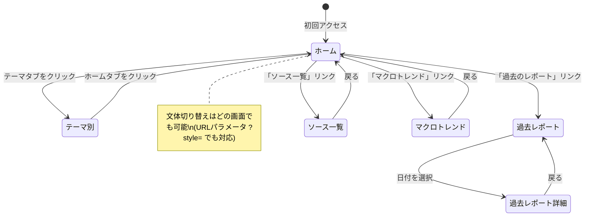

# ニュースダッシュボード グランドデザイン設計書

**リポジトリ**: `news-dashboard`  
**最終更新**: 2026-04-18  
**ステータス**: Phase 1 実装中

---

## 1. コンセプトと設計原則

### プロジェクト目的

1日の始まりに「だいたい見れば情報キャッチアップが完結」する個人用ニュースダッシュボード。

- **対象ユーザー**: 自分（lomoxiao）
- **利用シーン**: 朝5分のスキャン → 気になるものだけ深掘り
- **運用スタイル**: Claude Code Routineによる毎朝自動収集・生成。GitHub Pagesで閲覧

### 2段階UXコンセプト

| レベル | 時間 | 目的 | 操作 |
|--------|------|------|------|
| Level1（スキャン） | 5分 | 全体把握 | タイトル・1行サマリーを流し読み |
| Level2（深掘り） | 自由 | 詳細確認 | タップで展開・ソースリンクへ |

### 設計原則

- **データとビューの完全分離**: JSONがデータ、HTMLがビュー。文体切り替えはキー切り替えのみ
- **スキャン優先・読み物品質の両立**: Level1で全テーマを5分以内に把握できること
- **PC/スマホ両対応**: レスポンシブ（PC: 2カラム / スマホ: 1カラム）
- **URLパラメータによるビュー切り替え設計**: マルチモーダル対応の土台

---

## 2. システムアーキテクチャ

```mermaid
graph TB
    subgraph 収集・生成層
        A[Claude Code\nRoutine①②③④] -->|Web Search / RSS / API| B[生JSONデータ生成]
        M[手動トリガー\nGitHub Issue] -->|URL指定| B
    end

    subgraph データ層
        B --> C[(GitHubリポジトリ\nJSONファイル群)]
        C --> D[data/daily/YYYY-MM-DD.json]
        C --> E[data/metrics/master.json]
        C --> F[data/themes/*.json]
        C --> G[data/index.json]
    end

    subgraph 表示層
        D & E & F & G -->|fetch API| H[docs/index.html\nGitHub Pages]
        H -->|localStorage| I[文体選択状態保持]
    end

    style 収集・生成層 fill:#e8f4fd
    style データ層 fill:#fef9e7
    style 表示層 fill:#e9f7ef
```

### トリガーの種類

| トリガー | タイミング | 用途 |
|----------|-----------|------|
| 開発・テスト時 | 手動実行 | `claude --prompt "$(cat prompts/daily_collect.md)"` |
| 本番: Routine① | 毎朝6:00 | 日次ニュース収集・生成 |
| 本番: Routine② | 毎朝6:30 | 日次マクロ指標収集 |
| 本番: Routine③ | 毎週月曜7:00 | 週次テーマ累積サマリー |
| 本番: Routine④ | 毎月1日 | 月次アーカイブ・圧縮 |
| GitHub Issue | 随時 | 会員制記事の手動追加 |

---

## 3. リポジトリ構成

```
news-dashboard/
├── config.json                        # テーマ・ソース設定（運用者が編集）
├── prompts/
│   ├── daily_collect.md               # 日次収集・生成プロンプト（Layer1-3統合）
│   ├── metrics_collect.md             # 日次マクロ指標収集プロンプト
│   ├── weekly_summary.md              # 週次累積サマリープロンプト
│   ├── monthly_archive.md             # 月次アーカイブ・圧縮プロンプト
│   ├── _role.md                       # Layer1のみ（週次・月次でも使い回し）
│   ├── _output_format.md              # Layer3のみ（スキーマ変更時のみ修正）
│   └── _style_instructions.md        # 4文体の生成指示（config.jsonと対応）
└── docs/                              # GitHub Pages 送信ディレクトリ（ここ以下がすべて公開）
    ├── .nojekyll                      # Jekyll無効化（GitHub Pages設定）
    ├── config.json                    # テーマ・文体設定（フロントエンドが読む）
    ├── index.html                     # ダッシュボード本体
    ├── GRAND_DESIGN.md                # 本設計書
    └── data/                          # Routineの出力先（すべてここに書く）
        ├── index.json                 # レポート一覧・ソース一覧の目次
        ├── daily/
        │   └── YYYY-MM-DD.json        # 日次レポート（詳細）
        ├── metrics/
        │   ├── master.json            # 全期間マクロ指標時系列（グラフ用）
        │   └── daily/YYYY-MM-DD.json  # 日次指標スナップショット
        ├── themes/
        │   └── {テーマ名}.json        # テーマ別累積サマリー
        ├── monthly/
        │   └── YYYY-MM.json           # 月次アーカイブ
        └── logs/
            └── YYYY-MM-DD.log         # 収集エラーログ
```

---

## 4. データ構成（JSONスキーマ）

### 4-1. config.json

テーマ・キーワード・RSSソースを管理する設定ファイル。

```json
{
  "default_style": "journalist",
  "styles": {
    "journalist": {
      "label": "📰 記者風",
      "description": "新聞記者が書く簡潔・客観的な文体。事実と数値を中心に。",
      "prompt_instruction": "..."
    },
    "friendly":   { "label": "😊 フレンドリー", "..." : "..." },
    "brief":      { "label": "📋 箇条書き",     "..." : "..." },
    "analytical": { "label": "🔍 分析",         "..." : "..." }
  },
  "themes": [
    {
      "name": "最新AI情報",
      "emoji": "🤖",
      "category": "interested",
      "keywords": ["生成AI", "LLM", "AIエージェント"],
      "rss": ["https://zenn.dev/topics/ai/feed"],
      "qiita_tags": ["LLM", "生成AI"],
      "exclude_keywords": [],
      "importance_boost": 2
    }
  ],
  "must_know": {
    "sources": ["NHK", "日経新聞"],
    "min_sources": 2,
    "hatena_min_bookmarks": 500
  },
  "schedule": {
    "daily_collect": "06:00",
    "metrics_collect": "06:30",
    "weekly_summary": "07:00",
    "monthly_archive": "01:00"
  }
}
```

### 4-2. data/index.json

フロントエンドが最初に読む目次ファイル。

```json
{
  "last_updated": "2026-04-18T06:00:00+09:00",
  "reports": [
    { "date": "2026-04-18", "headline": "Anthropic、Claude Code Routineを正式リリース" }
  ],
  "all_sources": [
    { "name": "NHK", "url": "https://www3.nhk.or.jp/", "count": 12 }
  ],
  "themes": ["最新AI情報", "NTTドコモ", "量子コンピュータ", "金融決済", "国内・社会"]
}
```

### 4-3. data/daily/YYYY-MM-DD.json

2段階UX（Level1スキャン / Level2深掘り）に対応した構造。

```json
{
  "date": "2026-04-18",
  "generated_at": "2026-04-18T06:05:00+09:00",
  "top_summary": {
    "journalist": {
      "lead": "日銀・植田総裁が追加利上げを示唆し、市場では...",
      "highlights": [
        { "theme": "最新AI情報", "text": "AnthropicがClaude Code Routineを正式リリース..." },
        { "theme": "金融決済",   "text": "日銀が追加利上げを示唆。来週の決定会合が焦点..." }
      ],
      "must_read": {
        "title": "AI時代のエンジニアのキャリア戦略",
        "url": "https://example.com/article",
        "reason": "元Google・現Anthropicのエンジニアによる具体的な整理。",
        "bookmark_count": 1840
      }
    },
    "friendly":   { "...": "同構造" },
    "brief":      { "...": "同構造" },
    "analytical": { "...": "同構造" }
  },
  "topics": [
    {
      "theme": "最新AI情報",
      "category": "interested",
      "trend_score": 87,
      "trend_history": [72, 68, 75, 80, 82, 85, 87],
      "summary_short": "Claude Code Routineが正式リリースされた。",
      "summary_long": "Anthropicは2026年4月18日、自律型コーディングエージェント機能...",
      "articles": [
        {
          "title": "Claude Code Routine 正式リリース",
          "url": "https://www.anthropic.com/...",
          "source": "Anthropic",
          "summary_short": "Anthropicがコーディング自動化機能を正式公開した。",
          "summary_long": "毎朝スケジュール実行が可能となり...",
          "importance": 5,
          "fetch_failed": false
        }
      ],
      "related": []
    }
  ],
  "chart_data": {
    "trend_scores": { "最新AI情報": 87, "NTTドコモ": 42 },
    "source_distribution": { "Anthropic": 3, "NHK": 2 },
    "importance_distribution": { "1": 0, "2": 2, "3": 4, "4": 1, "5": 1 }
  }
}
```

### 4-4. data/themes/{テーマ名}.json

テーマ別週次累積サマリー（週次更新）。

```json
{
  "theme": "最新AI情報",
  "last_updated": "2026-04-18",
  "trend_direction": "上昇",
  "weekly_highlights": [
    {
      "title": "Claude Code Routine 正式リリース",
      "url": "https://...",
      "date": "2026-04-18",
      "importance": 5,
      "summary": "Anthropicが自律型コーディングエージェント機能を正式公開した。"
    }
  ],
  "stats": {
    "article_count": 18,
    "avg_importance": 3.2,
    "top_keywords": ["Claude", "LLM", "AIエージェント", "OpenAI", "Gemini"]
  },
  "trend_series": [
    { "date": "2026-04-12", "score": 72, "article_count": 3 }
  ]
}
```

### 4-5. 文体システム（Style System）

**設計方針**: Routineが収集時に4文体を同時生成しJSONに保存。フロントエンドはスタイルキーを切り替えるだけで即座に文体変更できる。データとプレゼンテーションの完全分離。

**config.json の styles 定義（抜粋）**

```json
{
  "default_style": "journalist",
  "styles": {
    "journalist": {
      "label": "📰 記者風",
      "prompt_instruction": "新聞記者として、簡潔・客観的に事実と数値を中心に記述..."
    },
    "friendly": {
      "label": "😊 フレンドリー",
      "prompt_instruction": "信頼できる知人が読者に話しかけるような文体で..."
    },
    "brief": {
      "label": "📋 箇条書き",
      "prompt_instruction": "箇条書きのみで記述。テーマごとに3点以内、全体10行以内..."
    },
    "analytical": {
      "label": "🔍 分析",
      "prompt_instruction": "データと根拠を重視し、背景・因果関係・今後の影響まで..."
    }
  }
}
```

**フロントエンドでの切り替え実装方針**
- ヘッダーに文体切り替えボタンを常時表示
- 選択状態は localStorage に保存（次回アクセス時も維持）
- URLパラメータ `?style=brief` でも切り替え可能（共有・ブックマーク対応）
- `config.json` の `styles` 定義を読んでボタンを動的生成（文体追加時にHTMLの変更不要）

---

## 5. 収集プロンプト設計方針

### 5-1. プロンプトの3層構造

```
prompts/daily_collect.md
├── Layer1: ロール定義      → Claudeの役割・絶対ルールを固定
├── Layer2: 収集手順         → ステップバイステップで処理順序を固定
└── Layer3: 出力フォーマット → JSONスキーマを直接埋め込み出力形式を固定
```

各Layerは単体ファイルとして切り出し、週次・月次プロンプトでも使い回せる設計。

### 5-2. Layer1（ロール定義）

プロンプト冒頭に必ず配置し、毎回読まれること。

```markdown
あなたはニュース編集者です。以下のルールを厳守してください。

## 絶対ルール
- 事実と数値のみ記述する。推測・意見・感想は書かない
- 情報源が不明確な内容は「未確認」と明記するか除外する
- 同じニュースを複数ソースで確認できる場合のみ採用する

## 禁止事項
- 「注目されています」などの主観的評価
- ソースリンクのない数値・統計の引用
- 1記事あたり150字を超えるsummary_shortの生成
```

### 5-3. Layer2（収集手順）

Step1〜7で処理順序を固定し、品質を安定させる。

```
Step1: ソース収集（Web Search + RSS）
Step2: テーマ毎振り分け（優先順位ルール適用）
Step3: 重要度スコアリング（3点以上のみ採用）
Step4: 本文fetch（失敗時はリードのみで続行）
Step5: サマリー生成（4文体同時生成）
Step6: 自己チェック（出力前の品質検証）
Step7: JSON出力・エラー処理
```

### 5-4. Layer3（サマリー生成ルール）

```markdown
- summary_short: 1文・50字以内・主語と述語を含む
- summary_long: 3〜5文・150字以内・背景→事実→影響の順で記述
- 数値は必ず単位付きで記載（例：「約30%増」「152円台」）
- 固有名詞は正式名称を使用（略称不可）
```

---

## 6. データ収集構成

### 6-1. 収集ソース一覧

| 情報種別 | 手段 | 取得内容 | 制約 |
|---------|------|---------|------|
| 一般ニュース | Web Search Tool | 本文・URL | なし |
| 技術記事 | Qiita API（公式） | 本文全文・ブクマ数 | 無料枠あり |
| 技術記事 | Zenn RSS + fetch | 本文全文 | なし |
| 注目トレンド | はてなブックマーク API | ブクマエントリ | なし |
| Xトレンド | Web SearchでX fetch | トレンドワード抽出 | 精度中程度 |
| 各メディア | RSS + fetch | タイトル・リード・本文（無料記事） | 会員制は見出しのみ |
| 会員制記事 | GitHub Issue投稿 → Routine処理 | URL指定で本文fetch・サマリ化 | 手動トリガー |
| 量子論文 | arXiv RSS（quant-ph） | アブスト → 日本語翻訳 | 英語のみ |
| 金融規制 | 金融庁・日銀 RSS | 公式発表・法令情報 | なし |
| NTTドコモ | ドコモ公式ニュースリリース RSS | 公式発表 | なし |

### 6-2. 収集の2層構造

**自動層**（毎朝Routine実行）
- Web Search Toolでテーマ別キーワード検索 → 無料記事は本文fetch
- Qiita APIでタグ・キーワード検索 → 本文サマリ化
- Zenn RSSをチェック → URL fetch → 本文サマリ化
- はてなブックマークAPIでブクマエントリ取得 → 「知るべきニュース」判定
- XトレンドページをWeb Searchでfetch → トレンドワード抽出

**手動層**（自動補完トリガー）
- 会員制記事URLをGitHub Issueに投稿
- Routine（GitHub trigger）がIssue検知 → fetch → サマリ → daily JSONに追記

### 6-3. 「知るべきニュース」の判定基準

Claudeが以下の基準でスコアリングして自動選定する。
- はてなブックマーク件数 500以上
- 複数メディアで同日報道
- 社会・経済・政治への影響度（Claudeが判定）

---

## 7. Claude Code Routine 構成

### Routine① 日次ニュース収集（毎朝6:00）

- **トリガー**: スケジュール（毎日6:00）
- **プロンプトファイル**: `prompts/daily_collect.md`
- **コネクタ**: Web Search Tool
- **出力**: `data/daily/YYYY-MM-DD.json`、`data/index.json` 更新

### Routine② 日次マクロ指標収集（毎朝6:30）

- **トリガー**: スケジュール（毎日6:30）※Routine①完了後に実行
- **プロンプトファイル**: `prompts/metrics_collect.md`
- **収集内容**:
  - arXiv論文数（cs.AI・quant-ph）
  - Google Trends スコア（テーマ別キーワード）
  - 株価・為替（日経平均・USD/JPY）
- **出力**: `data/metrics/daily/YYYY-MM-DD.json`、`data/metrics/master.json` に追記

### Routine③ 週次テーマ累積サマリー（毎週月曜7:00）

- **トリガー**: スケジュール（毎週月曜7:00）
- **プロンプトファイル**: `prompts/weekly_summary.md`
- **入力**: 過去7日分のdaily JSON + `data/metrics/master.json`
- **出力**: `data/themes/{テーマ名}.json` 更新

### Routine④ 月次アーカイブ（毎月1日）

- **トリガー**: スケジュール（毎月1日）
- **プロンプトファイル**: `prompts/monthly_archive.md`
- **処理**: 月次圧縮・古いdailyファイル削除・metricsの月次集計
- **出力**: `data/monthly/YYYY-MM.json`

### Routine⑤ 会員制記事処理（GitHub Issue trigger）

- **トリガー**: GitHub Issue作成
- **処理**: IssueのURL取得 → fetch → サマリ生成 → daily JSONに追記

---

## 8. グラフ・実態データ設計

### 8-1. マクロ指標の定義と収集方法

累積することで市場動向・トレンドの流れを把握するための3指標を日次収集する。

| 指標 | 取得元 | 取得方法 | 意味 |
|------|--------|---------|------|
| arXiv論文数 | ArXiv API | cs.AI・quant-phの当日投稿数 | AI・量子分野の研究活動量 |
| Google Trends | Web Search | テーマ別キーワードスコア（0〜100） | 社会的関心度の相対値 |
| 株価・為替 | Yahoo Finance API | 日経平均・USD/JPY終値 | 経済全体の体温 |

蓄積期間別に見てほしいもの：

```
30日  : 短期トレンドの上昇・下降を把握
90日  : 四半期での動向変化・季節性を確認
180日 : 半年スパンでの市場シフト把握
365日 : 年次比較・構造的変化を把握
```

### 8-2. metrics/master.json のスキーマ

全期間の時系列データを1ファイルに累積する。フロントエンドはこのファイルだけ読めばグラフを描画できる。

```json
{
  "last_updated": "2026-04-18",
  "series": {
    "arxiv_ai": {
      "label": "AI論文数（cs.AI）",
      "unit": "件/日",
      "data": [
        { "date": "2026-04-18", "value": 142 },
        { "date": "2026-04-17", "value": 138 }
      ]
    },
    "arxiv_quantum": {
      "label": "量子論文数（quant-ph）",
      "unit": "件/日",
      "data": [{ "date": "2026-04-18", "value": 67 }]
    },
    "trends": {
      "最新AI情報":       { "unit": "スコア(0-100)", "data": [{ "date": "2026-04-18", "value": 87 }] },
      "NTTドコモ":        { "unit": "スコア(0-100)", "data": [{ "date": "2026-04-18", "value": 42 }] },
      "量子コンピュータ": { "unit": "スコア(0-100)", "data": [{ "date": "2026-04-18", "value": 31 }] },
      "金融決済":         { "unit": "スコア(0-100)", "data": [{ "date": "2026-04-18", "value": 55 }] }
    },
    "markets": {
      "nikkei":  { "label": "日経平均", "unit": "円", "data": [{ "date": "2026-04-18", "value": 38420 }] },
      "usdjpy":  { "label": "USD/JPY",  "unit": "円", "data": [{ "date": "2026-04-18", "value": 152.3 }] }
    }
  }
}
```

### 8-3. トレンドスコアの定義

記事サマリの品質スコアとは別に、テーマの「盛り上がり」を0〜100で表す複合指標。

```
trend_score =
  記事数（当日） × 重要度スコア平均
  ÷ 過去7日平均
  × 100（最大100でキャップ）
```

### 8-4. グラフ配置と種類

**ホーム画面（ミニ表示）**

```
🤖 最新AI情報    ████████  +27%  ← スパークライン + 前日比
📱 NTTドコモ     █████      +2%
⚛️ 量子コンピュータ ████     -5%
💳 金融決済      ███       -8%
```

SVGで実装（ライブラリ不要・超軽量）

**テーマ別画面（チャート表示）**

| グラフ | 種類 | 期間 | 目的 |
|--------|------|------|------|
| トレンド推移 | 折れ線 | 7日間 | 流れを把握 |
| ソース分布 | ドーナツ | 当日 | 情報源の偏り確認 |
| 重要度分布 | 棒グラフ | 当日 | 記事密度の確認 |

**マクロトレンド画面（累積グラフ）**

| グラフ | 種類 | 期間選択 | 目的 |
|--------|------|---------|------|
| arXiv論文数推移 | 折れ線 | 30/90/180日 | 研究活動の流れ |
| Google Trends推移 | 複数折れ線（テーマ色分け） | 30/90/180日 | テーマ間比較 |
| 日経平均・USD/JPY | 折れ線（2軸） | 30/90/180日 | 経済全体の体温 |

**グラフライブラリ**

- スパークライン: カスタム SVG（依存なし）
- その他すべて: Chart.js（CDN読み込み・1ライブラリで完結）

---

## 9. UI/UX設計

### 9-1. 設計方針

- **2段階UX**: Level1（スキャン・5分）→ Level2（深掘り・タップで展開）
- **レスポンシブ**: PC 2カラム / スマホ 1カラム
- **画面遷移最小**: 基本はその場で展開。ページ移動は3画面のみ
- **マルチモーダル対応**: データとビューが完全分離。URLパラメータで切り替え
- **文体切り替え**: ヘッダーボタンで即時切り替え。選択状態はlocalStorageで永続化

### 9-2. 画面構成

**ホーム画面**

```
[ヘッダー] 日付・最終更新時刻・文体切り替えボタン [📰記者風][😊フレンドリー][📋箇条書き][🔍分析]
[今日の読み物] 概括リード・テーマ別ハイライト・今日の必読（5分）※選択文体で表示
[スパークライン] テーマ別トレンド推移（ミニグラフ）
[テーマタブ] 最新AI情報 / NTTドコモ / 量子コンピュータ / 金融決済 / 国内・社会
```

**テーマ別画面**（タブ押下）

```
[テーマグラフ] 7日間トレンド推移
[テーマサマリ] 読み物（2〜3行）
[記事一覧] タイトル + 1行サマリ（Level1）
  └ タップで展開 → 詳細サマリ + ソースリンク + 関連記事（Level2）
```

**過去レポート画面**（ページ移動）

```
[日付一覧] カレンダーまたはリスト形式
  └ 選択 → 当日と同じ構成で表示
```

**ソース一覧画面**（ページ移動）

```
[メディア一覧] 引用回数順
```

**マクロトレンド画面**（ページ移動）

```
[期間セレクタ] 30日 / 90日 / 180日 / 365日
[arXiv論文数推移] 折れ線グラフ（AI・量子）
[Google Trends推移] テーマ別複数折れ線
[株価・為替推移] 日経平均・USD/JPY
```

### 9-3. 画面遷移図



### 9-4. マルチモーダル対応（将来）

URLパラメータで表示とスタイルを切り替え。同一JSONデータを参照。

**viewパラメータ（レイアウト）**

| view値 | 表示スタイル | 優先度 |
|--------|------------|--------|
| default | 通常ダッシュボード | ✅ MVP |
| brief | 10行要約のみ | 🔜 次フェーズ |
| newspaper | 新聞風レイアウト | 🔜 次フェーズ |
| infographic | グラフ・ビジュアル中心 | 🔲 将来 |

**styleパラメータ（文体）**

| style値 | 文体 | 優先度 |
|---------|------|--------|
| journalist | 📰 記者風（デフォルト） | ✅ MVP |
| friendly | 😊 フレンドリー | ✅ MVP |
| brief | 📋 箇条書き | ✅ MVP |
| analytical | 🔍 分析 | ✅ MVP |

組み合わせ例: `?view=newspaper&style=brief&date=2026-04-18`

---

## 10. 現状の制約事項

| 制約 | 理由 | 将来の解決策 |
|------|------|------------|
| 会員制記事の自動全文取得不可 | ログインセッション不可 | Claude in Chrome実装後 |
| Xトレンドの高精度取得不可 | X API高額（$100/月〜） | 当面はfetch代替で対応 |
| Routine実行回数制限 | Pro:5回/日、Max:15回/日 | 開発中は手動実行で代替 |

---

## 11. 実装ロードマップ

### Phase 1: 基盤構築（手動実行で動作確認）

- [x] `config.json` 作成（テーマ・ソース・文体定義）
- [x] `prompts/daily_collect.md` 作成（4文体同時生成、Layer1-3構造）
- [x] 全プロンプトファイル作成（metrics / weekly / monthly）
- [x] JSONスキーマ・サンプルデータ作成
- [x] `docs/` 以下に全データを集約（GitHub Pages対応）
- [x] `.nojekyll` 追加

### Phase 2: UI完成

- [x] テーマタブ・記事展開UIの実装
- [x] スパークライン（SVG）実装
- [x] 文体切り替えボタンUI実装（config.jsonから動的生成）
- [x] マクロトレンド画面実装（Chart.js: arXiv・Trends・Markets）
- [x] 過去レポート・ソース一覧画面実装
- [x] レスポンシブ対応（PC 2カラム / スマホ 1カラム）
- [ ] GitHub Pages 有効化（Settings → Pages → docs/ ブランチ設定）

### Phase 3: Routine本番化（保留中）

- [ ] Routine①②③を登録（テスト完了後）
- [ ] GitHub Issue trigger（Routine⑤）設定
- [ ] 運用モニタリング

### Phase 4: マルチモーダル拡張

- [ ] `?view=brief` 実装
- [ ] `?view=newspaper` 実装
- [ ] 以降順次追加
